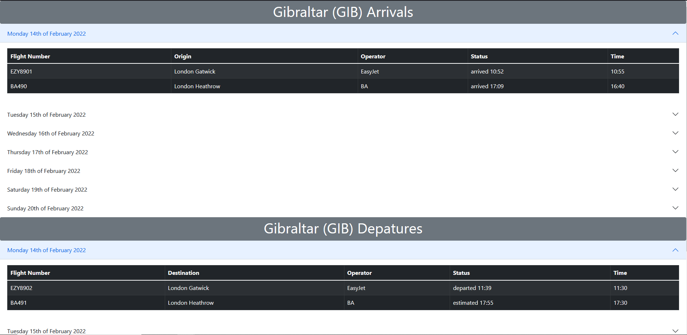

# Airport Arrivals / Depature Board

## Table of contents

- [Airport Arrivals / Depature Board](#airport-arrivals--depature-board)
  - [Table of contents](#table-of-contents)
  - [General info](#general-info)
  - [Technologies](#technologies)
  - [Status](#status)
  - [Tests](#tests)

## General info

Single page aiport arrival / depature information for GIB (Gibraltar Airport) which displays flight information in real time. Data is refreshed every minute, however GIB is not too busy at the moment so it may not be obvious.

Created for Opsveiw technical test.

App output:

Time permitting, I would have improved the styling and added tests. In addation it would have been fun to find a busier aiport, but I did not want to spend too much time looking for the perfect API. Total time spent was aprox 3 hrs, 45 mins, with the last hour spent on styling.

## Technologies

- React
- Redux / Redux tool kit
- react-bootstrap

## Status

Project is: alpha v0.1

## Tests

If I had time, I would add unit and intergration tests.
